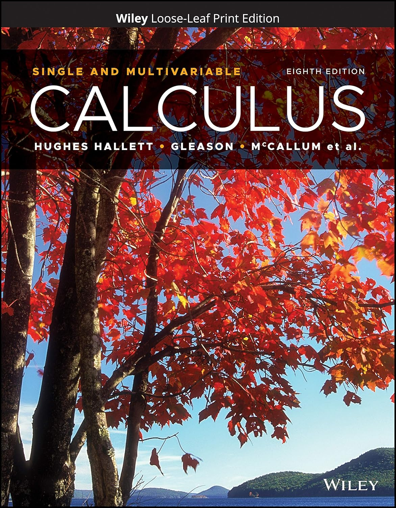

# Calculus: Single and Multivariable
8th Edition, published January 201

From the [Wiley site](https://www.wiley.com/en-us/Calculus%3A+Single+and+Multivariable%2C+8th+Edition-p-9781119694298):

> The 8th edition of Calculus: Single and Multivariable features a variety of problems with applications from the physical sciences, health, biology, engineering, and economics, allowing for engagement across multiple majors. The Consortium brings Calculus to (real) life with current, relevant examples and a focus on active learning.
>
> The Calculus Consortium's focus on the “Rule of Four” (viewing problems graphically, numerically, symbolically, and verbally) has become an integral part of teaching calculus in a way that promotes critical thinking to reveal solutions to mathematical problems. Their approach reinforces the conceptual understanding necessary to reduce complicated problems to simple procedures without losing sight of the practical value of mathematics. In this edition, the authors continue their focus on introducing different perspectives for students with an increased emphasis on active learning in a ‘flipped’ classroom.

## Resources
*  [Teacher Manual](../tmanCombo8e/index.md)
*  Concept Tests
    - [Single variable](../conceptTestsSingle8e/index.md)
    - [Multi variable](../conceptTestsMulti8e/index.md)
* [Calc LLM+Data Labs](../calc-LLM-labs/index.md)
* [Calc Python Labs](../calc-python-labs/index.md)
* [Climate Change](../climate/index.md) activities.
* [Covid-19](../covid/index.md) activities and textboook-style problems and activities.
* [Precalculus AI labs](../precalcAI/index.md) which can be used as a review for students while also learning about LLMs.
