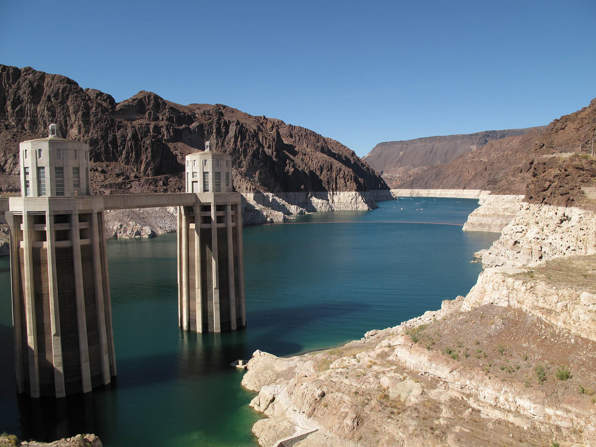
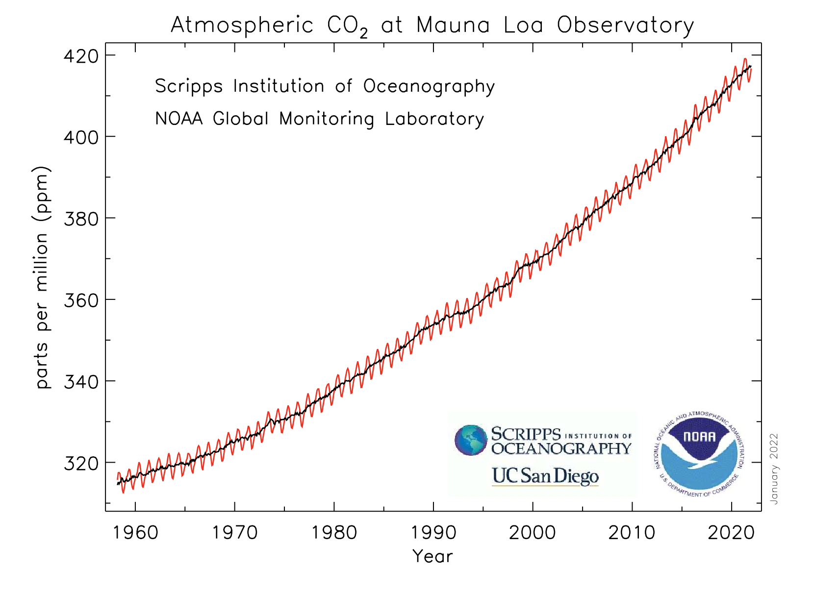
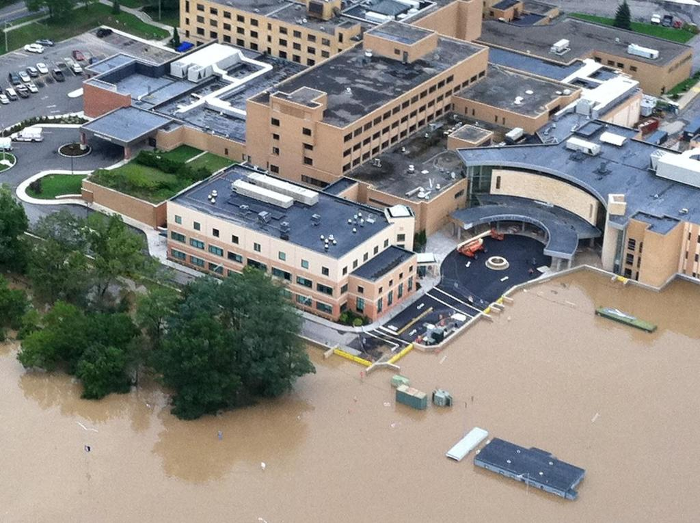
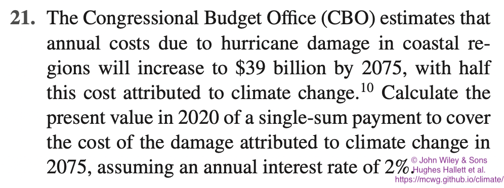
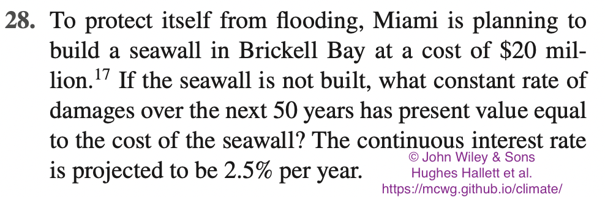
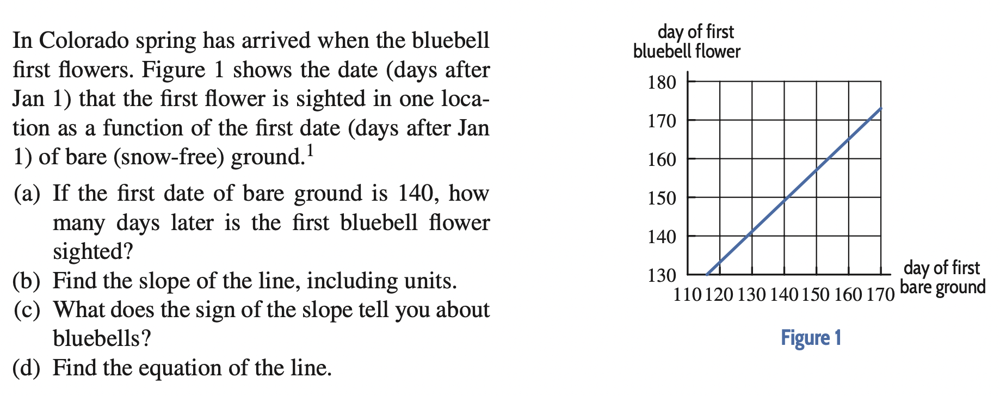
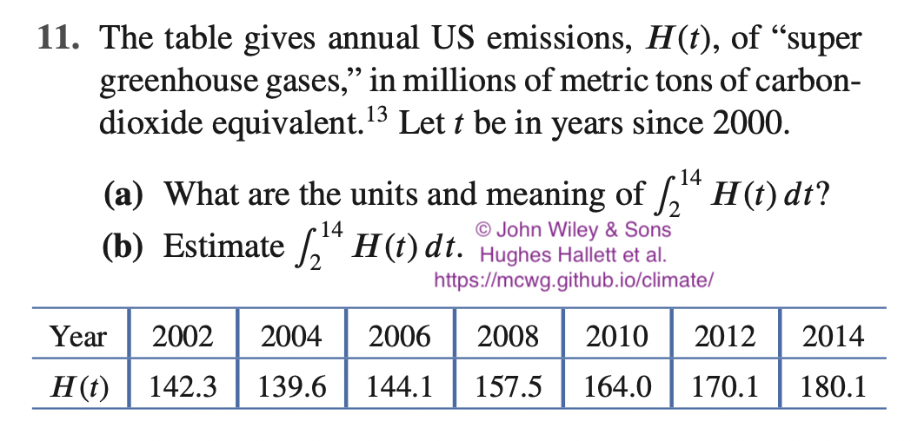
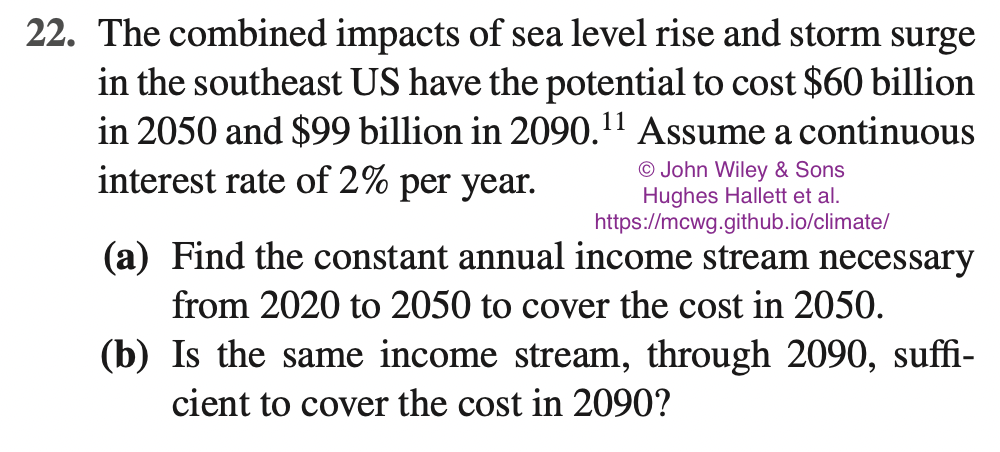

# Climate Change Resources from the Mathematics Consortium Working Group (MCWG)
This page has teaching resources related to the Climate Change for college-level Mathematics courses. 

These resources are copyrighted ©*Mathematics Consortium Working Group, Hughes Hallett et al.* and are distributed freely to promote their use and collect feedback. Our ultimate goal is to create a collection of resources that will help students understand the relevance of mathematical ideas in college-level Mathematics courses in a context which is affecting their lives directly. 

Contact us at **mcwg.contact@gmail.com**, or [subscribe below](#subscribe-for-news) if you would like to hear of any updates to this page or resources we create about this. We appreciate any feedback and would love to hear about your experiences using them.

## Percentages and Proportions: Lake Mead
  
(Picture from [Groksurf's San Diego](https://groksurf.com/2009/12/14/water-reuse-is-imperative-for-a-sustainable-san-diego/), CC-BY-SA 4.0 license).

This activity has students find different ways to express how much water Lake Mead has and is missing right now. This involves converting between units and could involve using scientific notation. 

<!-- Idea is to understand that it is highly certain that a shortage of water will happen, but it is uncertain when it will happen. -->

*  [PPT slides](/files/LakeMead.pptx) for teachers with details about this activity.
*  [Sample problem statements and solutions](/files/LakeMeadProblems.docx) to use in class.
<!-- *  [Spreadsheet](/files/IcebreakTucson-21_Sols_Full.xls) with data and solutions. (students can be asked to get the data themselves from the [NOAA site](https://www.wrh.noaa.gov/twc/climate/Tucson100s/Tucson100s_1st100.php)). -->

## Linear Decrease: Tucson Ice Break
  
(Picture from [wikipedia](https://commons.wikimedia.org/wiki/File:Saguaro_Sunset.jpg), CC-BY 3.0 license).

This activity has students find a linear trend line for the data on the first day temperature goes over 100F at Tucson Airport each year.  

They will find that there is variability in the data which makes predictions uncertain, but date definitely  seems to be changing (about 1 day earlier each decade). They will also see that the vertical intercept of the trend line is meaningless (ice break in Tucson was definitely not in October-November in the year 0 AD).

*  [PPT slides](/files/TucsonIceBreak.pptx) for teachers with details about this activity.
*  [Sample problem statements and solutions](/files/TucsonIceBreakProblems.docx) to use in class.
*  [Spreadsheet](/files/IcebreakTucson-21_Sols_Full.xlsx) with data and solutions. (students can be asked to get the data themselves from the [NOAA site](https://www.wrh.noaa.gov/twc/climate/Tucson100s/Tucson100s_1st100.php)).

## Linear Decrease: Japanese Cherry Blossoms
  
(Photo by Bagus Pangestu downloaded from [pexels](https://www.pexels.com/photo/after-the-rain-cherry-blossom-cherry-blossoms-japan-1483894/), free to use).

This activity has students find a linear trend line for the data on the full flowering date for cherry trees at Kyoto since 9th century. They will find that there is variability in the data which makes predictions uncertain, but date definitely  seems to be changing (about 4 days in 70 years).

*  [PPT slides](/files/CherryBlossoms.pptx) for teachers with details about this activity.
*  [Spreadsheet](/files/KyotoFlowerDates.xlsx) with data. (students can be asked to get the data themselves from [this site](http://atmenv.envi.osakafu-u.ac.jp/aono/kyophenotemp4/)).

## Exponential Functions: Sea Level rise and Lourdes Hospital Floodwall
<!--  -->
  
(Public domain image from [U.S. National Archives & DVIDS](https://nara.getarchive.net/amp/media/flooding-binghamton-n-y-september-8-2011-a-floodwall-built-with-hazard-mitigation-f6044e)).

This activity has students analyze the expenditure for the Lourdes Hospital floodwall. They need to convert all costs and benefits to present values (exponential decay) and then add them together to decide if floodwall is payed off. 

<!-- The graph shows the monthly mean CO_2 concentration data from Mauna Loa observatory in Hawaii, which has been collecting data related to climate change since the 1950s. -->

*  [PPT slides](/files/SeaLevelRise.pptx) about examples of Sea Level Rise.
<!-- *  [Sample problem statements and solutions](/files/MaunaLoaProblems.docx) to use in class. -->
<!-- *  [More details here](/mauna-loa.md) (spreadhseets with solutions, in depth discussion of the activity, sample graphs, follow-up activities, fancy models, links to data sources). -->

<!-- Image and data from [NOAA](https://gml.noaa.gov/ccgg/trends/mlo.html),  -->

## Linear and Exponential Growth: Carbon Dioxide Mauna Loa Data
<!--  -->
  
(Picture by Christopher Michel licensed under CC-BY 2.0, downloaded from [flikr](https://www.flickr.com/photos/cmichel67/43725689770)).

This activity has students attempt to fit linear and exponential models to the trend line in the CO2 data. They will find growth is *more* than exponential.

<!-- The graph shows the monthly mean CO_2 concentration data from Mauna Loa observatory in Hawaii, which has been collecting data related to climate change since the 1950s. -->

*  [PPT slides](/files/ClimateChangeMaunaLoa.pptx) for teachers with details about this activity.
*  [Sample problem statements and solutions](/files/MaunaLoaProblems.docx) to use in class.
*  [More details here](/mauna-loa.md) (spreadhseets with solutions, in depth discussion of the activity, sample graphs, follow-up activities, fancy models, links to data sources).

<!-- Image and data from [NOAA](https://gml.noaa.gov/ccgg/trends/mlo.html),  -->

## Climate Change Textbook Problems (Sample)

The following is a small sample of climate change related problems that we have made for our textbooks

*  _Calculus, Single Variable, 8th edition, Hughes Hallett et al., John Wiley & Sons, 2020_ 
*  _Applied Calculus, 7th edition, Hughes Hallett et al., John Wiley & Sons, 2022_

<!-- (from _Applied Calculus, 7th edition, Hughes Hallett et al., John Wiley & Sons, 2022_)
 -->

#### Present value: (exponential decay)

 

#### Present value of a cost stream: (integration)

 

<!-- (from _Applied Calculus, 7th edition, Hughes Hallett et al., John Wiley & Sons, 2022_)
 -->

<!--   -->

<!-- (from _Calculus, Single Variable, 8th edition, Hughes Hallett et al., John Wiley & Sons, 2020_)
 -->
#### Interpreting integrals:

 

<!-- (from _Calculus, Single Variable, 8th edition, Hughes Hallett et al., John Wiley & Sons, 2020_)
 -->

#### Present value of a cost stream: (integration)

 

<!-- (from _Calculus, Single Variable, 8th edition, Hughes Hallett et al., John Wiley & Sons, 2020_)
 -->

<!-- 
Climate Change
==============
Problems:
*  3-4e95.tex (Mauna Loa CO2)
*  1-5e72.tex (Mauna Loa CO2)
*  3-misce108.tex (Rising Global temperatures)
*  2-5e50.tex (CFCs)
*  2-4e57 (CFCs)
*  2-4e30.tex (greenland ice sheet)
*  2-misce68.tex (sea level rise)
*  1-1e69.tex (sea level rise)
*  1-1e52
*  1-2ahdaqnp01
*  ins8-6e14-17
*  2-5e29
*  8-6e40
*  8-6dhhenp01
*  8-6dhhenp10
*  8-6dhhenp11
*  5-3e34.tex
*  8-6e21
*  8-6e22
*  8-6e40
*  11-5e33

Sections:
*  SINGLE - sec8-6: 
*  BUS - bsec6-5: subsection: Climate Change and Its Costs
*  BUS - bsec1-7: subsection: Climate Change and Its Costs
 -->

<!-- # Consortium members working on this project
*  Deborah Hughes Hallett
*  Enrique Acosta Jaramillo
*  Daniel Flath
*  Adam Spiegler
*  ????
*  [[ Deb, COMPLETE LIST ???]] -->

## Subscribe for news
If you would like to hear of any updates to this page or resources we create about this, please fill out this [Google Form](https://docs.google.com/forms/d/e/1FAIpQLSdL2nQEN5MyPGuK35nNsA_ZIPxShvIU6FAT5nD6lU6x-Xv81w/viewform?usp=sf_link).

## Contact Us
Write to **mcwg.contact@gmail.com**. Please let us know how you found this site.
