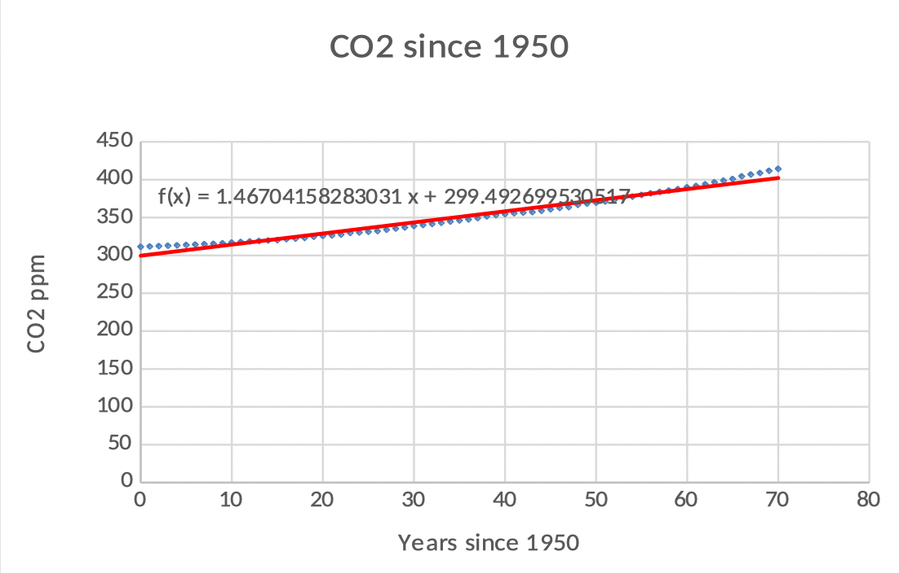
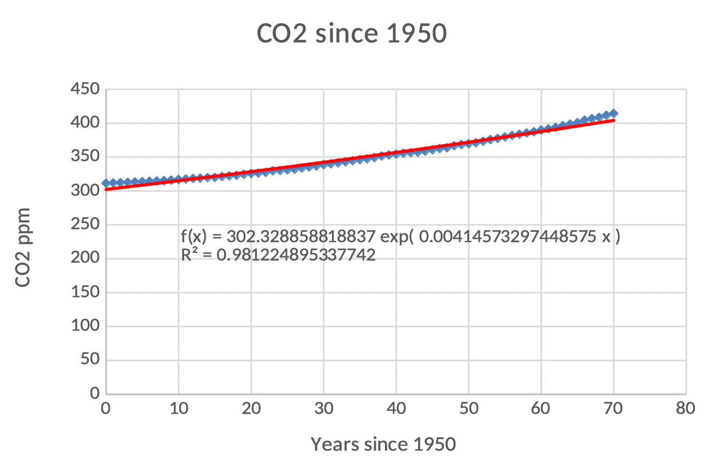
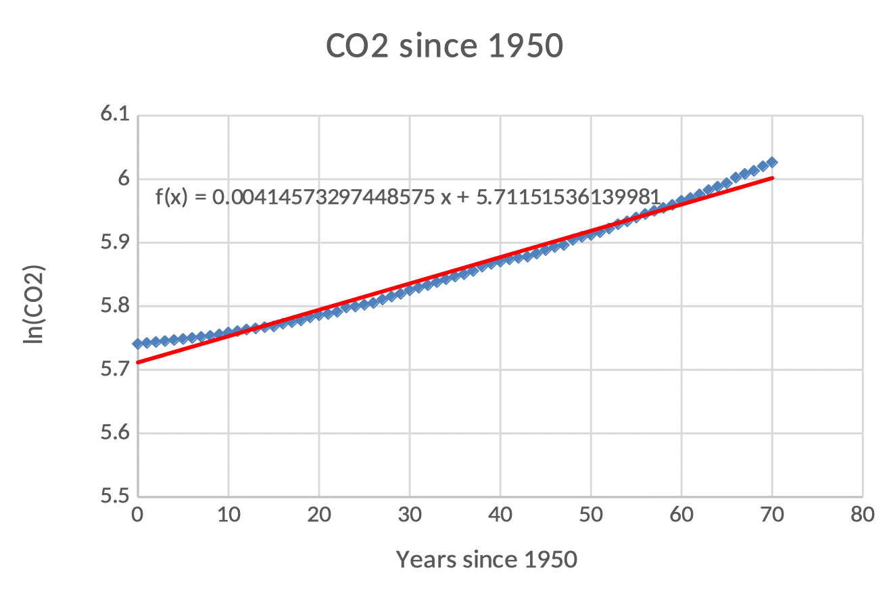
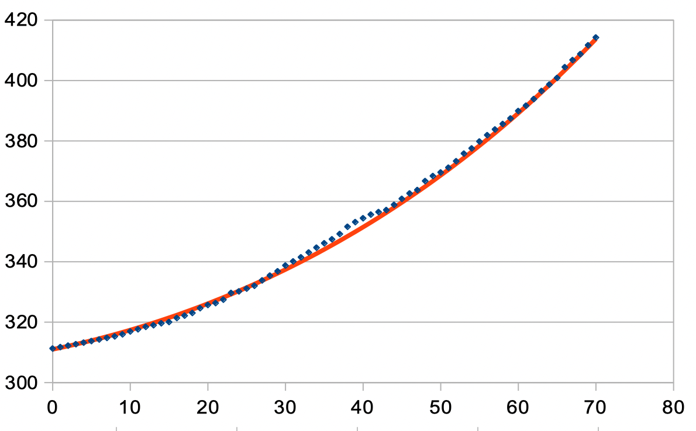
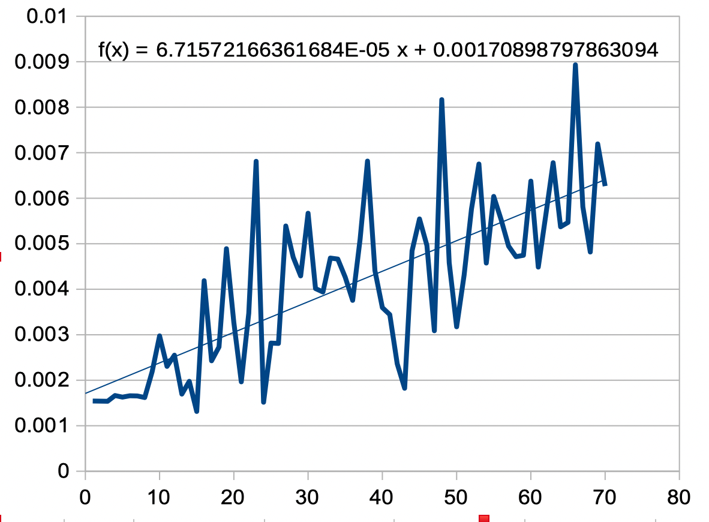

Link to main [MCWG Climate Change Resources site](index.md).

# Mauna Loa CO2 data

<!--  -->

The Mauna Loa observatory in Hawaii, 11,135ft above sea level, has been continuously collecting data related to climate change since the 1950s. (Image from Christopher Michel licensed under CC-BY 2.0 downloaded from [flikr](https://www.flickr.com/photos/cmichel67/43725689770)). 

The graph below shows the monthly mean CO_2 concentration data from Mauna Loa. This is known as the [Keeling Curve](https://en.wikipedia.org/wiki/Keeling_Curve), named after Charles David Keeling who started the monitoring program. The Keeling Curve is the black curve in the image, which removes seasonal variation. (Image and data from [NOAA](https://gml.noaa.gov/ccgg/trends/mlo.html))

<!--  -->

## Main interesting question about this data
Is the Keeling curve linear or exponential? How can we tell?

## What students will find:

### Keeling curve is not linear
*  Graph below: Linear Fit
*  Linear function does not fit well
*  Slope  is too large in 1950 and too small in 2020
*  Interpret slope: An increase of 1.47 ppm per year
*  Interpret intercept: Projected CO2 in 1950 was 299.34 ppm

<!--  -->

### Keeling curve is not exponential
*  Exponential function also does not fit well
*  Climbing slower in 1950 and faster in 2020
*  Seems to be growing faster than an exponential!
*  Interpret intercept: Projected CO2 in 1950 was 297.82 ppm
*  Interpret growth rate:  Increases continuously at 0.41% ppm/yr 

<!--  -->

### Log plot or plot of ln(CO_2) to see the "super exponential" growth
The fact that the plot of ln(CO_2) is still concave up (plot below) means that the data cannot be fit well by an exponential (if f(t) is exponential, then the plot of ln(f(t)) is a line).

In the graph below the slope of the line is the continuous growth rate:  0.41% ppm/yr.

<!--  -->

### It is not unreasonable to assume that growth factor, instead of constant, is growing linearly
The model in the plot below is given by P_0(b+mt)^t=311(1.0017+0.0000341t)^t

<!--  -->

Finding this model is more involved. It requires plotting the growth factors between each year and looking for a trend line, then tweaking the parameters until a good fit is obtained. Plot of growth factors is shown below:

### There are other non super-exponential models

One "almost exponential" one is given by: g(t)= C+Ba^t=267.277+48.703(1.01823)^t

A quadratic one is given by: h(t)=0.013t^2+0.8055t+315.5219

## Getting the data for your students
Students can get the data, or you can give it to them:

*  Data is freely available at the [NOAA](https://gml.noaa.gov/ccgg/trends/mlo.html) site. 
*  You can download the [spreadsheet file](./files/CO2Temp-20.xlsx) we created with relevant plots. You can share only the data with students, and have them make the plots.

## Teaching Resources
*  [Sample problem statements and solutions](/files/MaunaLoaProblems.docx) to use in class.
*  [PPT slides](/files/ClimateChangeMaunaLoa.pptx) for teachers with details about this activity.

# More Climate Change teaching resources
See our main [MCWG climate change site](index.md).

# Subscribe for news
If you would like to hear of any updates to this page or resources we create about this, please fill out the  form in the following [Google Form](https://docs.google.com/forms/d/e/1FAIpQLSdL2nQEN5MyPGuK35nNsA_ZIPxShvIU6FAT5nD6lU6x-Xv81w/viewform?usp=sf_link).

# Contact Us
Write to **mcwg.contact@gmail.com**. Please let us know how you found this site.
