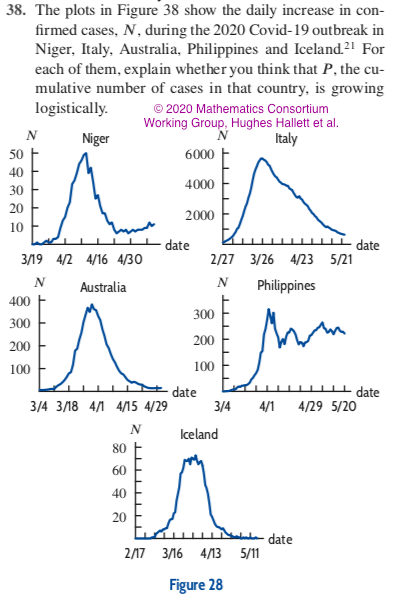

# Mathematics Consortium Working Group (MCWG) Covid-19 resources
This page has teaching resources related to the Covid-19 pandemic for college-level Mathematics courses. 

These resources are copyrighted © *2020 Mathematics Consortium Working Group, Hughes Hallett et al.* or ©*John Wiley & Sons* and are distributed freely to promote their use and collect feedback. Our ultimate goal is to create a collection of resources that will help students understand the relevance of mathematical ideas in college-level Mathematics courses in a context which is affecting their lives directly. 

Contact us at **mcwg.contact@gmail.com**. We appreciate any feedback and would love to hear about your experiences using them.

**Note:** Several problems in this site will be available in _Applied Calculus, 7th edition, Hughes Hallett et al., John Wiley & Sons, 2022_.

### Consortium members working on this project
*  Deborah Hughes Hallett
*  Enrique Acosta Jaramillo
*  Daniel Flath
*  Brigitte Lahme 
*  Ayşe A. Şahin
*  Thomas Tucker
*  Aaron Wootton

# Sample problems
<!--  -->
  
  

<!--
| Tables        | Are           | 
| ------------- |:-------------:|
|      |  | 
|      |       | 
-->

More sample problems by course or topic (see Instructor Notes for solutions):
*  [Quantitative Reasoning](./samplePdfs/coronaQRSample.pdf)
*  [Precalculus](./samplePdfs/coronaPrecalcSample.pdf)
*  [Differential Calculus](./samplePdfs/coronaCalcSample.pdf)
*  [Integral Calculus](./samplePdfs/coronaIntegralSample.pdf)
*  [Differential Equations](./samplePdfs/coronaDiffEqSample.pdf)
*  [Log Plots](./samplePdfs/coronaLogScaleSample.pdf)

# Complete sets of problems together with instructor notes
**Note:** The following links will only work if (1) you are logged into github with your browser (login [here](https://github.com/login) and return to this site), and (2) your github user has access to the MCWG's github COVID19 repository.  **If you do not have access, you will get a 404 "file not found" error.** Contact us  at **mcwg.contact@gmail.com** to get access.

*  [Precalc instructor notes and problems](https://github.com/mcwg/data/blob/master/covid19/InstructorNotes/20210213coronaPrecalcAll.pdf) and [solutions](https://github.com/mcwg/data/blob/master/covid19/InstructorNotes/20210213coronaPrecalcAllSols.pdf).
*  [Calculus instructor notes and problems](https://github.com/mcwg/data/blob/master/covid19/InstructorNotes/20210617coronaCalc.pdf) and [solutions](https://github.com/mcwg/data/blob/master/covid19/InstructorNotes/20210617coronaCalcSols.pdf).
*  [Log scale section draft](https://github.com/mcwg/data/blob/master/covid19/InstructorNotes/20200929LogScale.pdf)

# Spreadsheet data exploration projects
**Note:** The following links will only work if (1) you are logged into github with your browser (login [here](https://github.com/login) and return to this site), and (2) your github user has access to the MCWG's github COVID19 repository.  **If you do not have access, you will get a 404 "file not found" error.** Contact us  at **mcwg.contact@gmail.com** to get access. 

*  **Understanding data smoothing using moving averages**: [Statement](https://github.com/mcwg/data/blob/master/covid19/SpreadsheetProjects/corona-dhhnp002/corona-dhhnp002.pdf), [data](https://github.com/mcwg/data/blob/master/covid19/SpreadsheetProjects/corona-dhhnp002/corona-dhhnp002dat.xls), and solutions([pdf](https://github.com/mcwg/COVID19/tree/master/covid19/SpreadsheetProjects/corona-dhhnp002/corona-dhhnp002-Sols.pdf) and [spreadsheet file](https://github.com/mcwg/COVID19/tree/master/covid19/SpreadsheetProjects/corona-dhhnp002/corona-dhhnp002ansdat.xls)).
*  **Exploring 14-day new case accumulation as an approximation to active cases**: [Statement](https://github.com/mcwg/data/blob/master/covid19/SpreadsheetProjects/corona-eajnp084/corona-eajnp084.pdf), [data](https://github.com/mcwg/data/blob/master/covid19/SpreadsheetProjects/corona-eajnp084/corona-eajnp084dat.xls), and solutions([pdf](https://github.com/mcwg/COVID19/tree/master/covid19/SpreadsheetProjects/corona-eajnp084/corona-eajnp084-Sols.pdf) and [spreadsheet file](https://github.com/mcwg/COVID19/tree/master/covid19/SpreadsheetProjects/corona-eajnp084/corona-eajnp084ansdat.xls)).
*  **Discovering Logistic growth in data from Taiwan**: [Statement](https://github.com/mcwg/data/blob/master/covid19/SpreadsheetProjects/corona-dhhnp001/corona-dhhnp001.pdf), [data](https://github.com/mcwg/data/blob/master/covid19/SpreadsheetProjects/corona-dhhnp001/corona-dhhnp001dat.xls), and solutions([pdf](https://github.com/mcwg/COVID19/tree/master/covid19/SpreadsheetProjects/corona-dhhnp001/corona-dhhnp001-Sols.pdf) and [spreadsheet file](https://github.com/mcwg/COVID19/tree/master/covid19/SpreadsheetProjects/corona-dhhnp001/corona-dhhnp001ansdat.xls)).
*  **Discovering Gompertz growth in data from Italy**: [Statement](https://github.com/mcwg/data/blob/master/covid19/SpreadsheetProjects/corona-eajnp076/corona-eajnp076.pdf), [data](https://github.com/mcwg/data/blob/master/covid19/SpreadsheetProjects/corona-eajnp076/corona-eajnp076dat.xls), and solutions([pdf](https://github.com/mcwg/COVID19/tree/master/covid19/SpreadsheetProjects/corona-eajnp076/corona-eajnp076-Sols.pdf) and [spreadsheet file](https://github.com/mcwg/COVID19/tree/master/covid19/SpreadsheetProjects/corona-eajnp076/corona-eajnp076ansdat.xls)).

# Getting data for your classes: <!-- Covid-19 apps created by Isaac Flath for the MCWG -->
Raw data for countries and US states, together with their 7-day smoothing (see instructor documents) can be downloaded using a website that Isaac Flath built for the Consortium. 
*  [https://isaac-flath.shinyapps.io/coronavirus2/](https://isaac-flath.shinyapps.io/coronavirus2/)
<!-- *  [https://isaac-flath.shinyapps.io/Covid-19/](https://isaac-flath.shinyapps.io/Covid-19/) -->

These two sites simplify enormously the process of getting the Covid-19 outbreak data from Johns Hopkins University for a specific region of the world. In particular, they allow students to easily explore and download data.

# Applets
Below are two samples. More applets are available in the Instructor notes. 
#### Fitting a Logistic function to the Covid-19 outbreak in Iceland

#### Fitting a Gompertz function to the Covid-19 outbreak in Italy

#### Moving average for different periods

<!--
#  Webwork problems
ADD embedded problem
ADD link to site with the pg files.
-->

# This may be a sensitive topic for your students
Talking about the Covid-19 pandemic in class must be done thoughtfully, as the pandemic has hurt millions of people, including possibly some of your students. We believe that if presented empathetically, Covid-19 data can provide an opportunity to energize students by working on problems that have real importance to them.  

We believe it is important to be open with the students about the challenges in working with emotionally charged material. A class discussion or email leading to class agreement to proceed with the material can be helpful. Be explicit about the reasons for introducing Covid-19 materials (for example, that mathematics has provided insight used by policy-makers attempting to control the pandemic, and that it is important data to analyze because of its relevance to all of us). There may still be some students who are not ready to deal with Covid-19 data, and perhaps they can be given alternative ways to engage with the material.

# Contact Us
Write to **mcwg.contact@gmail.com**. Please let us know how you found this site.
