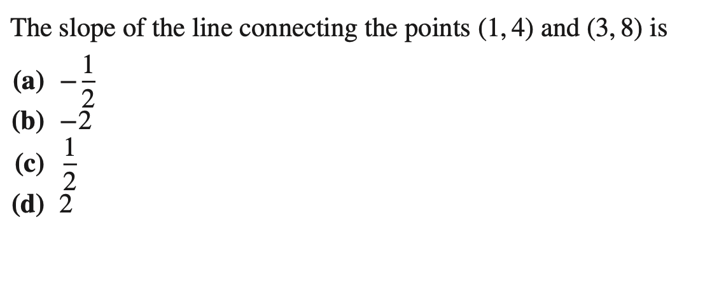
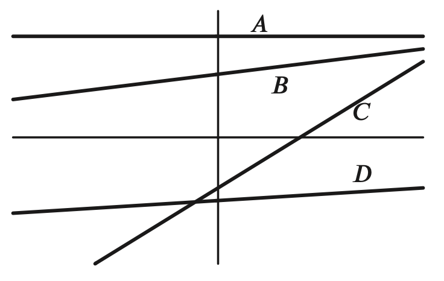
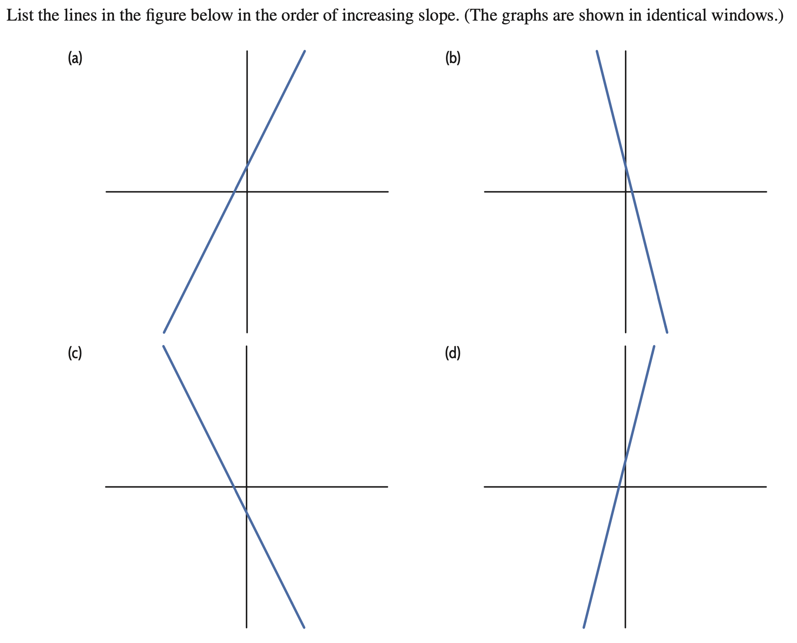
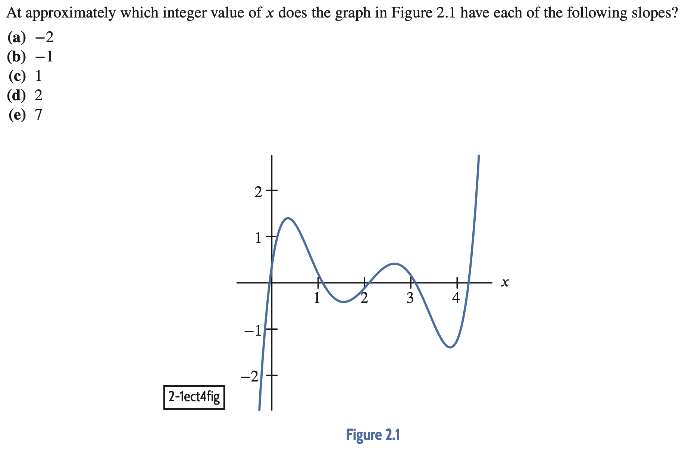
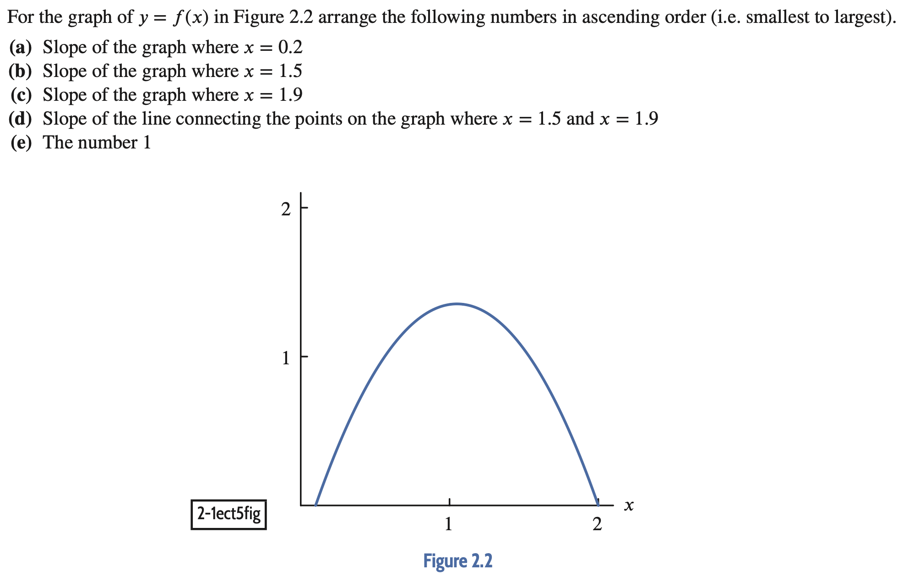

# Quick quiz
## Slopes

<!-- - from CT in single 1-1:
+  1-1ect4
+  1-1ect6
- from CT in single 2-1:
+  2-1ect4
+  2-1ect5
-  from precalc CTs
+  ins1-3phct4-7 (needs to be split up) -->

<!--   -->
  
1. <!-- 1-1ect4 -->
     
   

1. <!-- 1-3phct4 -->
   Which function has the greatest slope?  
   (a) A  
   (b) B  
   (c) C  
   (d) D  
   (e) None  
   

1. <!-- 1-3phct6 -->
   Which functions have a negative slope?  
   (a) A  
   (b) B  
   (c) C  
   (d) D  
   (e) None  
   

1. <!-- 1-3phct6 -->
   Which function could have a zero slope? 
   (a) A  
   (b) B  
   (c) C  
   (d) D  
   (e) None  
   

1. <!-- 1-1ect6 -->
     
   

1. <!-- 2-1ect4 -->
     
   

1. <!-- 2-1ect5 -->
     
   
