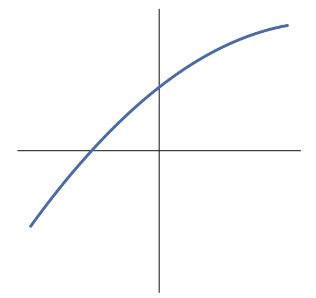
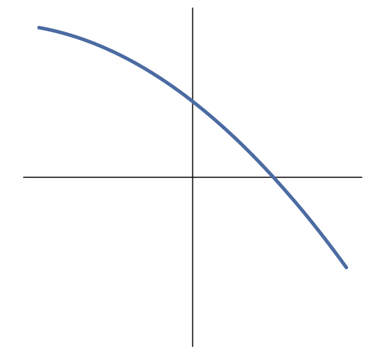
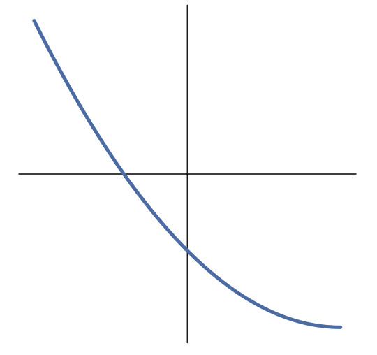
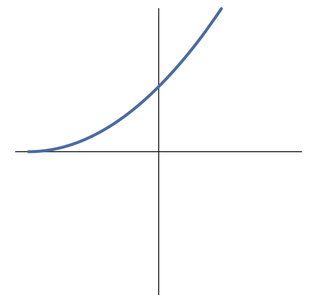
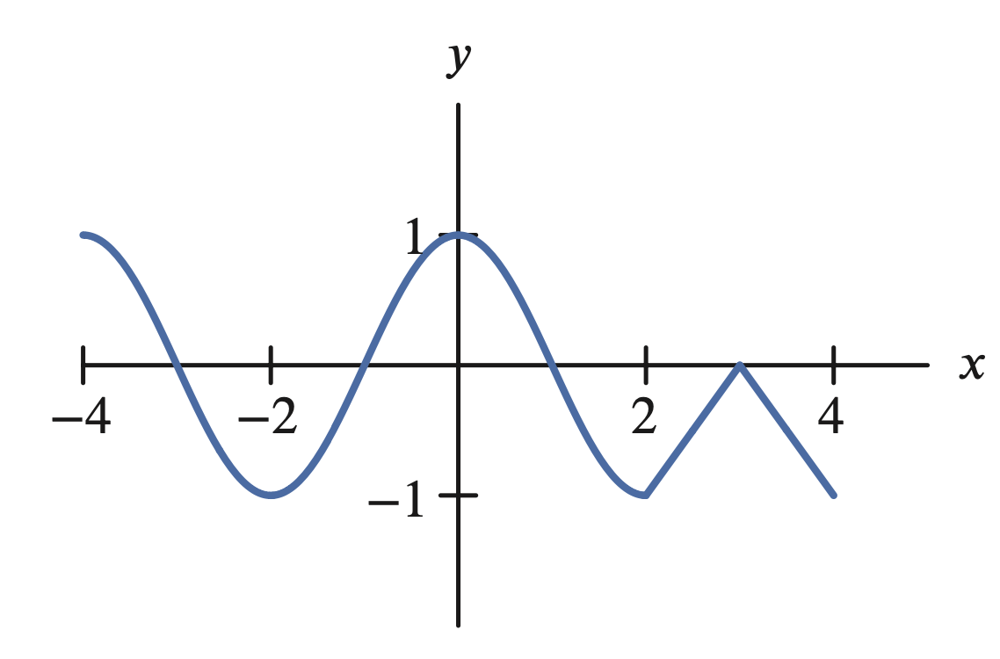

<!-- +  display each of the "canonical exponentials" e^x, -e^x, e^(-x) and -e^(-x), and ask of they are concave up or concave down. Or use figs Figure 2.45---Figure 2.48 in pchap2. -->
<!-- From CT precalc: -->
<!-- +  2-6phct3 -->
<!-- +  2-6phct11 -->
<!-- +  ins2-6phct12-17 (but needs to be split up). -->
1. Concave up, concave down, or neither?
   (a) Concave up
   (b) Concave down
   (c) Neither

   

1. Concave up, concave down, or neither?
   (a) Concave up
   (b) Concave down
   (c) Neither

   

1. Concave up, concave down, or neither?
   (a) Concave up
   (b) Concave down
   (c) Neither

   

1. Concave up, concave down, or neither?
   (a) Concave up
   (b) Concave down
   (c) Neither

   

1. True or False? All functions have graphs that are either concave up or concave down.
   (a) True 
   (b) False 

1. On the interval \(0\lt x\lt 1\), the graph is: 
   (a) Concave up
   (b) Concave down
   (c) Neither concave up nor concave down
   (d) Parts concave up, parts concave down
   
   
   

